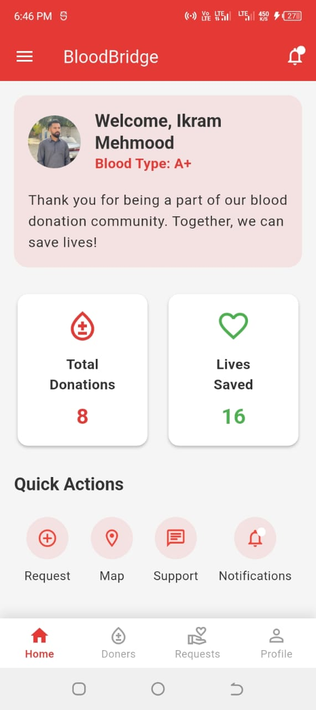
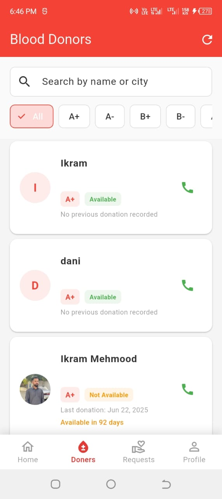

# Blood Donation App

A cross-platform Flutter application to connect blood donors and recipients, with Firebase integration for authentication, notifications, and real-time data.

## Features
- User registration & login (Firebase Auth)
- Request and donate blood
- View and manage blood donation requests
- Push notifications for requests and updates
- Donor and recipient profiles
- Health tracking for donors
- Google Maps integration for nearby donors/requests
- Support and information screens

## Screenshots

### Home Screen


### Authentication


### Donation Features



### User Interface


## Getting Started

### Prerequisites
- [Flutter SDK](https://flutter.dev/docs/get-started/install)
- [Firebase Project](https://console.firebase.google.com/)
- Android Studio or Xcode (for mobile builds)

### Setup
1. **Clone the repository:**
   ```sh
   git clone https://github.com/IkramMehmmod/blood-donation-app.git
   cd blood-donation-app/blood_donation_app
   ```
2. **Install dependencies:**
   ```sh
   flutter pub get
   ```
3. **Firebase setup:**
   - Add your `google-services.json` (Android) to `android/app/`
   - Add your `GoogleService-Info.plist` (iOS) to `ios/Runner/`
   - Update `firebase_options.dart` if needed (see [FlutterFire CLI](https://firebase.flutter.dev/docs/cli/))
4. **Run the app:**
   ```sh
   flutter run
   ```

## Project Structure
```
lib/
  models/         # Data models
  routes/         # App route definitions
  screens/        # UI screens (auth, donation, profile, etc.)
  services/       # Business logic, Firebase, notifications
  theme/          # App theming
  widgets/        # Reusable widgets
```

## Contributing
Pull requests are welcome! For major changes, please open an issue first to discuss what you would like to change.

## License
This project is private. For usage or licensing, contact the repository owner.
